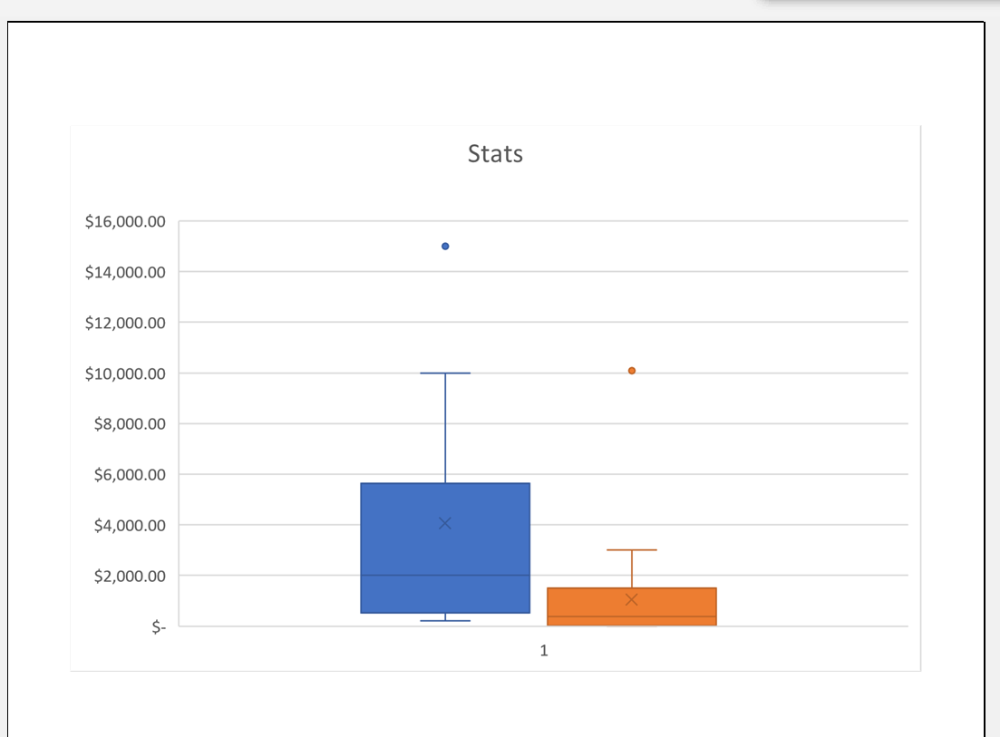

This is my module 1 challenge

### Challenge
From the graph “outcomes based on launch date” one can conclude that out of 1393 campaigns more than half of the campaigns are successful. The months do not have a serious affect on the success of the campaigns.

Campaigns between lower than 1000-15000 tend to all be successful. Amounts higher than 15000 tend to fail. The failure does not mean she couldn’t raise money it just means she could not raise her goal amount. The chances of her failing are less than 30%.

